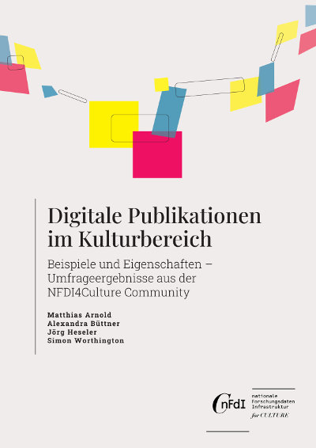

## Digital Publications in Culture: Examples and Key Features – Survey Results from the NFDI4Culture Community

by Matthias Arnold, Alexandra Büttner, Jörg Heseler, and Simon Worthington

v1.0

 > German translation: [Digitale Publikationen im Kulturbereich: Beispiele und Eigenschaften – Umfrageergebnisse aus der NFDI4Culture Community](https://tibhannover.github.io/digitale-publikationen-im-kulturbereich-umfrageergebnisse/)

<picture>
 <source media="(prefers-color-scheme: dark)" srcset="cover/cover-small.jpg">
 <source media="(prefers-color-scheme: light)" srcset="cover/cover-small.jpg">
 
</picture>

Task Area 4 of the [NFDI4Culture](https://nfdi4culture.de/) is looking at which initiatives are enhancing their publications for open scholarship. Its aim is to establish a guideline for scholars to create publications and their associated data with a focus on long-term digital preservation.

In order to get a full understanding of existing enhanced publications in the NFDI4Culture community an online survey was conducted. Its aim was to gather further representative examples. The survey was also used to get a better understanding of what the NFDI4Culture community considers to be an enhanced publication and what features they associate with it.

The survey has shown a variety of examples and contexts which go beyond standard research publications or digital collections. In addition, it has shown that a term is needed, that can capture multimodal, multimedia and multilocal publications.

### Cite as

Arnold, Matthias, Alexandra Büttner, Jörg Heseler, and Simon Worthington. 2022. ‘Digital Publications in Culture: Examples and Key Features – Survey Results from the NFDI4Culture Community’. Digital Publications and Data Working Group (NFDI4Culture). Germany. https://doi.org/10.5281/zenodo.7107214.

© The Authors. 

 This work is licensed under a <a rel="license" href="http://creativecommons.org/licenses/by-sa/4.0/">Creative Commons Attribution-ShareAlike 4.0 International License</a>.

