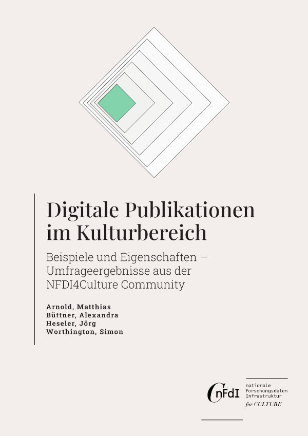

## Digitale Publikationen im Kulturbereich: Beispiele und Eigenschaften – Umfrageergebnisse aus der NFDI4Culture Community

von Matthias Arnold, Alexandra Büttner, Jörg Heseler, und Simon Worthington

v1.0

 > Englische Version: [Digital Publications in Culture: Examples and Key Features – Survey Results from the NFDI4Culture Community](https://tibhannover.github.io/digital-publications-in-culture-survey-results/)

<picture>
 <source media="(prefers-color-scheme: dark)" srcset="cover/cover-small.jpg">
 <source media="(prefers-color-scheme: light)" srcset="cover/cover-small.jpg">
 
</picture>

Der Aufgabenbereich TA4 „Datenpublikation und Langzeitarchivierung” der [NFDI4Culture](https://nfdi4culture.de/) untersucht, welche Initiativen ihre Publikationen für Open Scholarship verbessern. Ziel ist es, Guidelines für Wissenschaftler:innen zu erstellen, um digitale Publikationen samt Forschungsdaten mit Schwerpunkt digitale Langzeitarchivierung zu veröffentlichen.

Um ein umfassendes Verständnis der bestehenden Enhanced Publications in der NFDI4Culture Community zu erhalten, wurde eine Online-Umfrage durchgeführt. Ihr Ziel war es, weitere repräsentative Beispiele zu sammeln. Die Umfrage diente auch dazu, ein besseres Verständnis dafür zu erlangen, was die NFDI4Culture Community unter einer Enhanced Publication versteht und welche Merkmale sie damit assoziiert.

Die Umfrage hat gezeigt, dass es eine Vielzahl von Kontexten gibt, die über Standard-Forschungspublikationen oder digitale Sammlungen hinausgehen. Darüber hinaus hat sie gezeigt, dass ein Begriff benötigt wird, der multimodale, multimediale und multilokale Publikationen erfassen kann.

### Zitiert als

Arnold, Matthias, Alexandra Büttner, Jörg Heseler, und Simon Worthington. 2023. „Digitale Publikationen im Kulturbereich: Beispiele und Eigenschaften – Umfrageergebnisse aus der NFDI4Culture Community“. Die Arbeitsgruppe „Digitale Publikationen und Daten“. Deutschland. https://doi.org/10.5281/zenodo.7126012.

© Die Autoren. 

 Dieses Werk ist lizenziert unter einer <a rel="license" href="http://creativecommons.org/licenses/by-sa/4.0/">Creative Commons Namensnennung - Weitergabe unter gleichen Bedingungen 4.0 International Lizenz</a>.

